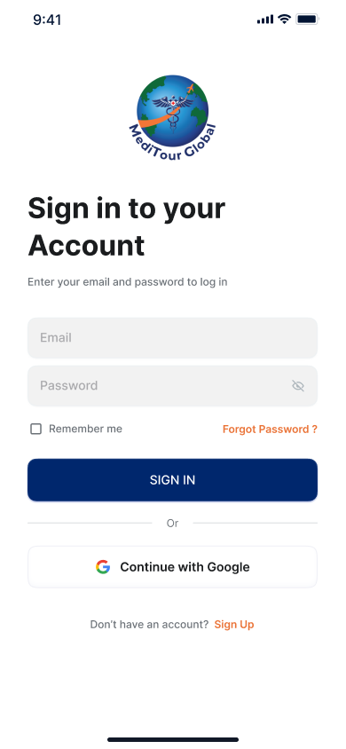

# **Meditour Global - Mobile App**

**Meditour Global** is a comprehensive **medical tourism mobile application** built with **React Native** and the **MERN stack**. The app connects patients with healthcare providers worldwide, offering a seamless mobile experience for discovering and booking medical treatments abroad. It features a clean UI, dynamic content, and real-time data integration.

---

## **Table of Contents**

- [Description](#description)  
- [Technologies Used](#technologies-used)  
- [Features](#features)  
- [Installation](#installation)  
- [Folder Structure](#folder-structure)  
- [Screenshots](#screenshots)  
- [License](#license)

---

## **Description**

Meditour Global is a mobile app that enables users to explore and book healthcare services across international destinations. The app uses **React Native** for a smooth cross-platform experience, and the backend is powered by **MongoDB**, **Express.js**, and **Node.js**. **Redux** handles state management, and **Axios** facilitates API communication, providing real-time data from hospitals and clinics worldwide.

---

## **Technologies Used**

### **Frontend (Mobile App)**


- **React Native**: Cross-platform mobile app development framework.
- **Redux**: Global state management across components.
- **Axios**: For handling HTTP requests.
- **React Navigation**: Navigation and routing within the app.
- **AsyncStorage**: Local data persistence.
- **CSS-in-JS / Styled Components**: For UI styling and themes.

### **Backend (API & Database)**

- **Node.js**: JavaScript runtime for server-side logic.
- **Express.js**: Backend framework for building RESTful APIs.
- **MongoDB**: NoSQL database for storing user data, appointments, and healthcare provider information.
- **Mongoose**: MongoDB object modeling for Node.js.

---

## **Features**

- ✅ **Cross-Platform Support**: Works on both Android and iOS devices using a single codebase.  
- 🔐 **Authentication**: Secure login and registration with token-based authentication.  
- 🌐 **Real-time API Integration**: Fetch data about hospitals, treatments, and doctors in real-time.  
- 🔍 **Search & Filters**: Easily search for providers based on location, specialties, or treatment type.  
- 📅 **Booking System**: Book appointments and receive confirmations within the app.  
- 📍 **Location-Based Services**: Detect and suggest medical centers based on user's location.  
- 👤 **User Dashboard**: Manage profile, bookings, and treatment history.  
- 📱 **Responsive & Intuitive UI**: Mobile-optimized components and screens for a seamless user journey.

---

## **Installation**

To set up and run the mobile app locally, follow these steps:

1. **Clone the repository**:

   ```bash
   git clone https://github.com/your-username/Meditour-Global-Mobile.git
   cd Meditour-Global-Mobile
   ```

2. **Install dependencies**:

   ```bash
   npm install
   ```

3. **Run on Android or iOS**:

   - For Android:
     ```bash
     npx react-native run-android
     ```

   - For iOS (macOS only):
     ```bash
     npx react-native run-ios
     ```

4. **Start Backend (Optional)**  
   If you also want to run the backend:

   ```bash
   cd server
   npm install
   npm run dev
   ```

---

## **Folder Structure**

```
Meditour-Global-Mobile/
├── src/
│   ├── components/         # Reusable UI components
│   ├── screens/            # Main screens like Home, Search, Profile, etc.
│   ├── navigation/         # React Navigation setup
│   ├── redux/              # Redux store, actions, reducers
│   ├── api/                # Axios API calls
│   ├── utils/              # Utility functions
│   ├── assets/             # Images, icons, fonts
│   └── App.js              # Main entry component
├── server/                 # Express.js backend
│   ├── models/             # Mongoose models
│   ├── routes/             # API endpoints
│   ├── controllers/        # Route controllers
│   └── server.js           # Backend entry point
├── package.json            # Project metadata and scripts
└── README.md
```

---

## **Screenshots**

> _Add real screenshots from your app below by replacing the placeholder paths_


  
  

  

<!--   
  
   -->

---

## **License**

This project is licensed under the **MIT License** – see the [LICENSE](./LICENSE) file for details.

---

### **MIT License Summary**

The MIT License is a permissive open-source license that allows for the following:

- **Usage**: You can use, copy, modify, merge, publish, distribute, sublicense, and/or sell copies of the Software.
- **Attribution**: You must include the original copyright notice and license.
- **Warranty Disclaimer**: The software is provided "as is", without warranty of any kind.

For the full license, refer to the [LICENSE](./LICENSE) file.

---
